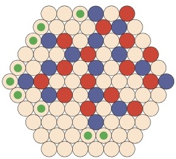
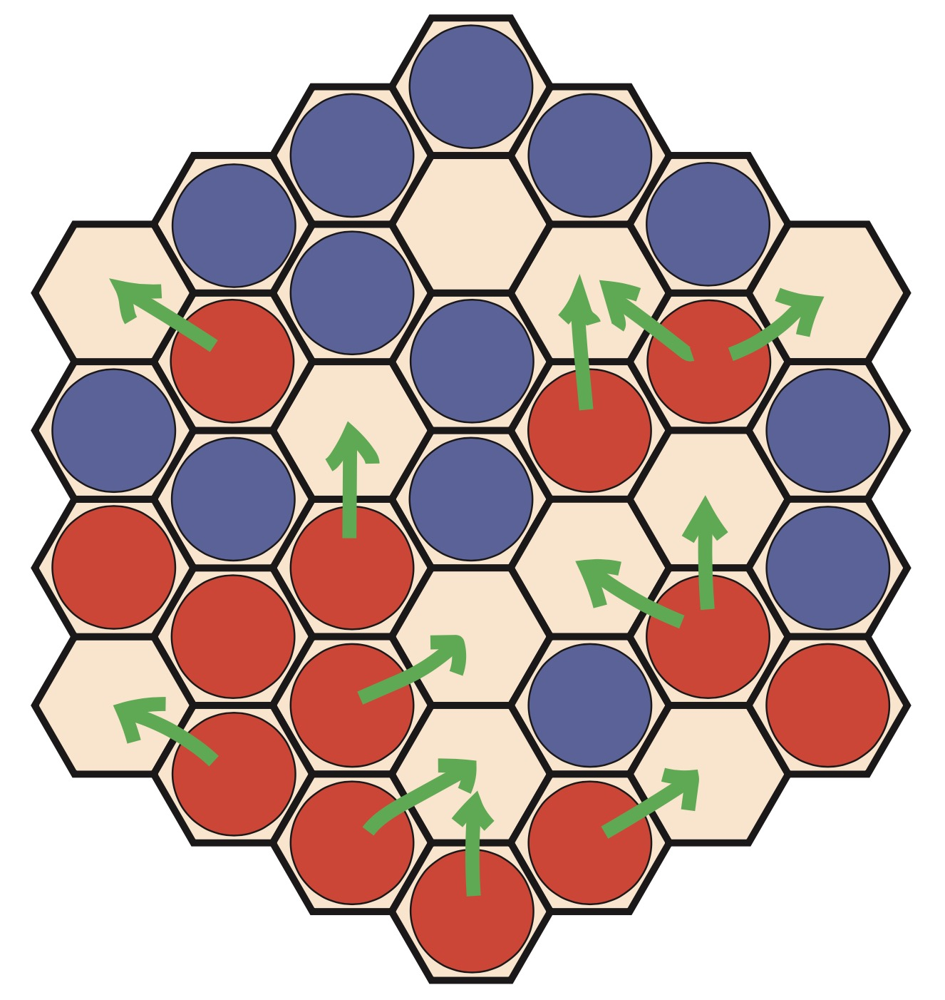

# IA02 - Projet - P24

Ce projet met en place plusieurs strategies d'Intelligence Artificielle permettant de jouer aux jeux Dodo et Gopher.  

 {: style="height:83px"}  {: style="height:83px"}

# Mise en place des outils de jeu

## Configuration du projet

```bash
git clone https://gitlab.utc.fr/guegathe/ia02_project.git
cd ia02_project
conda create --name ia02 python=3.12 
conda activate ia02
pip install -r requirements.txt
```

## Utilisation du server

Le serveur s'exécute en ligne de commande (terminal sous linux et macOS, powershell sous windows) 

1. Copier le bon executable dans votre répertoire de travail. On suppose par la suite que l'exécutable s'appelle `/server/gndserver`
2. Ajouter les droits en exécution (si besoin sous linux et MaxOS) : `chmod a+x /server/gndserver`
3. Vérifier le fonctionnement et voir les options : `./server/gndserver`

```bash
# toutes les options
./server/gndserver -h
```

```bash
# lancer un serveur de dodo contre un joueur random
./server/gndserver -game dodo -random 
```

```bash
# lancer un serveur de gopher contre un joueur random
./server/gndserver -game gopher -random
```

```bash
# lancer un serveur de gopher contre un joueur random gopher qui sera la joueur bleu
./server/gndserver -game gopher -rcolor blue -random
```

```bash
# tout réinitialiser
rm config.json server.json
```

## Utilisation du client

1. Ouvrir le fichier `main.py` et définir votre strategy en adaptant la ligne `x`avec une des statégies suivantes :  

- strategy_mc  
- strategy_mcts  
- strategy_negascoot
- strategy_alphabeta
- strategy_random

2. Lancer le client via la commande suivante :

```bash
# lancer le client
python3 main.py 12 theo aubin
```


Credits : Aubin Vert & Théo Guegan
