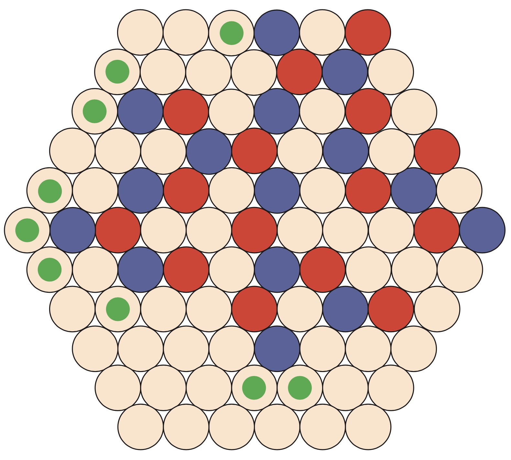

# **Go-like Games AI Strategies**

## **Description**
This project implements several Artificial Intelligence (AI) strategies for two Go-like games: **Dodo** and **Gopher**. The AI was developed using **Python**, with each game relying on different strategies like Alpha-Beta pruning and Monte Carlo Tree Search (MCTS) to optimize decision-making in various game scenarios.

<div id="image-table">
    <table>
	    <tr>
    	    <td style="padding:10px">
        	    
      	    </td>
            <td style="padding:10px">
            	
            </td>
        </tr>
    </table>
</div>

## **Table of Contents**
1. [Setup](#setup)
2. [Server Usage](#server-usage)
3. [Client Usage](#client-usage)
4. [Running Simulations](#running-simulations)
5. [Strategies](#strategies)
6. [Our Approach](#our-approach)

## **Setup**
For the best experience, it's recommended to use a virtual environment. Here's how you can set up the project with **Anaconda**:

```bash
git clone git@github.com:theguega/AI-for-Go-like-game.git
cd ia02_project
conda create --name ia02 python=3.12 
conda activate ia02
pip install -r requirements.txt
```

## **Server Usage**
The server can be run directly from the command line (Linux, macOS, or PowerShell for Windows):

1. Copy the correct executable into your working directory. For this example, we assume the executable is `/server/gndserver`.
2. If using Linux or macOS, grant execution rights:
   ```bash
   chmod a+x /server/gndserver
   ```
3. Verify the setup and check available options:
   ```bash
   ./server/gndserver -h
   ```

Examples:
```bash
# Start a Dodo server against a random player
./server/gndserver -game dodo -random
```

```bash
# Start a Gopher server against a random blue player
./server/gndserver -game gopher -rcolor blue -random
```

To reset configurations:
```bash
rm config.json server.json
```

## **Client Usage**
To run the client, use the following command:

```bash
# Run the client
python3 main.py group_number player1_name player2_name
```

## **Running Simulations**
To launch game simulations:

```bash
# Run simulations
python3 simulations.py
```

We implemented a script to automate large-scale simulations for testing purposes. The results are exported to text files, and performance profiling is included to measure function execution times. Parameters such as `EXPORT`, `SIZE`, `DISPLAY`, `NAME`, and `NB_ITERATION` can be adjusted in the script.

Available strategies for players, adjustable at lines `71` and `81`:
```python
action = env.strategy_random()
action = env.strategy_mc(SIMU)
action, env.root = env.strategy_mcts(SIMU,env.root)
action = env.strategy_alpha_beta(DEPTH)
action = env.strategy_alpha_beta_cache(DEPTH)
```
Note: In the current script, only one player can use MCTS with tree preservation during simulations. This was sufficient for our testing.

## **Strategies**

#### **Random**
This strategy plays a random legal move. Its main advantage is its speed, though its move quality is low. This strategy is primarily used in simulations by the Monte Carlo algorithms. We've optimized legal move generation for speed, achieving O(legal_moves).

#### **Alpha-Beta**
This strategy explores possible moves to maximize the player's advantage. Alpha-Beta cuts down unnecessary branches, making it more efficient than full-tree exploration. A heuristic evaluation function is used to estimate outcomes at a given depth. While it can be powerful, the performance is highly dependent on the depth and evaluation function.

#### **Alpha-Beta with Cache**
An improved version of Alpha-Beta, this strategy caches previously explored game states to improve execution time. Cached nodes store alpha, beta, and node scores. This method shares the same drawbacks as Alpha-Beta but offers faster performance.

#### **Monte Carlo**
This probabilistic approach simulates random game completions from each possible move, selecting the move with the highest win rate. It offers flexibility in terms of speed depending on the number of simulations, but the accuracy improves only with many iterations (Central Limit Theorem).

#### **Monte Carlo Tree Search (MCTS)**
MCTS refines Monte Carlo by prioritizing "promising" moves based on Upper Bound Confidence (UBC). It explores some moves more intensively than others. By preserving the tree and updating the root based on the actual moves, this method converges faster towards better decisions. However, performance is tied to the number of simulations and the UCT heuristic.

### **Our Approach**
After numerous simulations, we opted for an **Alpha-Beta with cache** strategy for the **Gopher** game, with an evaluation function based on the number of legal moves to maximize available options. The depth can be adjusted as needed.

For **Dodo**, we chose an MCTS approach with root preservation to maintain the tree across moves. This increases the accuracy of subsequent moves. We experimented with a time-based simulation method but encountered reliability issues, so we defaulted to a simulation count-based approach.

---

Crédits : Aubin Vert & Théo Guegan - GI02 - P24